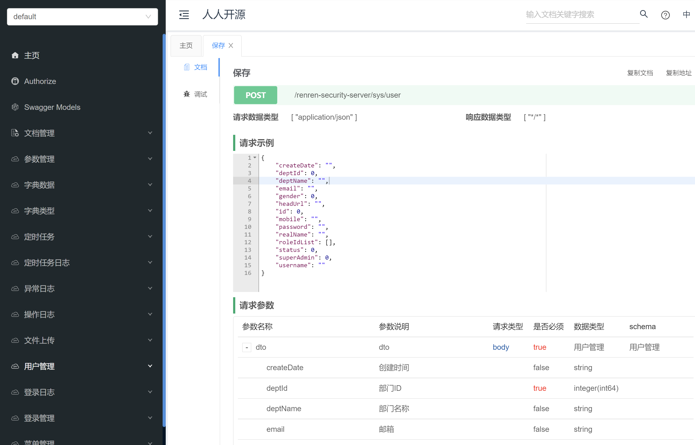

### 模块介绍
https://www.renren.io/guide

- renren-common为公共模块，其他模块以jar包的形式引入进去，主要提供些工具类，以及renren-admin、renren-api模块公共的entity、mapper、dao、service服务，防止一个功能重复多次编写代码。
- renren-admin为后台模块，也是系统的核心，用来开发后台管理系统，可以打包成jar，部署到服务器上运行，或者打包成war，放到Tomcat8.5+容器里运行。
- renren-api为接口模块，主要是简化APP开发，如：为微信小程序、IOS、Android提供接口，拥有一套单独的用户体系，没有与renren-admin用户表共用，因为renren-admin用户表里存放的是企业内部人员账号，具有后台管理员权限，可以登录后台管理系统，而renren-api用户表里存放的是我们的真实用户，不具备登录后台管理系统的权限。renren-api主要是实现了用户注册、登录、接口权限认证、获取登录用户等功能，为APP接口的安全调用，提供一套优雅的解决方案，从而简化APP接口开发。
- renren-generator为代码生成器模块，只需在MySQL数据库里，创建好表结构，就可以生成新增、修改、删除、查询、导出等操作的代码，包括entity、mapper、dao、service、controller、页面等所有代码，项目开发神器。

### 启动介绍

- 创建数据库 renren_security ，数据库编码为 UTF-8
- 执行数据库脚本，如MySQL数据库，则执行 db/mysql.sql 文件，初始化数据
- 修改application-dev.yml，更改数据库账号和密码
- 【启动renren-admin项目】

admin配置文件里renren.redis.open 可以设置为true， 这样就依赖了reis。

运行io.renren.AdminApplication.java的main方法，则可启动renren-admin项目
项目访问路径：http://localhost:8080/renren-admin
账号密码：admin/admin
Swagger注解路径：http://localhost:8080/renren-admin/doc.html
- 【启动renren-api项目】
Eclipse、IDEA运行ApiApplication.java，则可启动项目【renren-api】
Swagger路径：http://localhost:8081/renren-api/doc.html
- 启动renren-generator项目】
Eclipse、IDEA运行GeneratorApplication.java，则可启动项目【renren-generator】
项目访问路径：http://localhost:8082/renren-generator

- 启动前端 本项目下的renren-ui目录就是前端工程文件

`npm install --registry=https://registry.npmmirror.com`

`npm run dev`

这样即可访问前端。

正式项目， 需要前端打包成dist文件夹 `npm run build:prod`。然后部署到nginx里：

	server {
	  listen 18001;			 
	  # listen [::]:9000;
	  # gzip config
	  gzip on;
	  gzip_min_length 1k;
	  gzip_comp_level 9;
	  gzip_types text/plain text/css text/javascript application/json application/javascript application/x-javascript application/xml;
	  gzip_vary on;
	  gzip_disable "MSIE [1-6]\.";
	  location / {
		root   D:/develop/workspace/java/gitee/quanxian/renren-security/renren-ui/dist;	#项目资源文件加载目录
		index  index.html; #项目首页文件
	  }
	}


### 测试
admin/admin登录 http://localhost:18001/#/login 即可访问。

postman的测试,  参照[http请求的备份文件](/renren-admin/src/main/resources/public/renren-security.postman_collection.json)


### 项目说明
- renren-security是一个轻量级的，前后端分离的Java快速开发平台，能快速开发项目并交付【接私活利器】
- 采用SpringBoot、Shiro、MyBatis-Plus、Vue3、TypeScript、Element Plus、Vue Router、Pinia、Axios、Vite框架，开发的一套权限系统，极低门槛，拿来即用。设计之初，就非常注重安全性，为企业系统保驾护航，让一切都变得如此简单。
- 提供了代码生成器，只需编写30%左右代码，其余的代码交给系统自动生成，可快速完成开发任务
- 支持MySQL、达梦、Oracle、SQL Server、PostgreSQL等主流数据库
- 演示地址：http://demo.open.renren.io/renren-security （账号密码：admin/admin）

<br>

### 微信交流群
我们提供了微信交流群，扫码下面的二维码，关注【人人开源】公众号，回复【加群】，即可根据提示加入微信群！
<br><br>


<br>

### 具有如下特点
- 友好的代码结构及注释，便于阅读及二次开发
- 实现前后端分离，通过token进行数据交互，前端再也不用关注后端技术
- 灵活的权限控制，可控制到页面或按钮，满足绝大部分的权限需求
- 提供CrudService接口，对增删改查进行封装，代码更简洁
- 页面交互使用Vue3.x，极大的提高了开发效率
- 完善的部门管理及数据权限，通过注解实现数据权限的控制
- 完善的XSS防范及脚本过滤，彻底杜绝XSS攻击
- 完善的代码生成机制，可在线生成entity、xml、dao、service、vue、sql代码，减少70%以上的开发任务
- 引入quartz定时任务，可动态完成任务的添加、修改、删除、暂停、恢复及日志查看等功能
- 引入Hibernate Validator校验框架，轻松实现后端校验
- 引入云存储服务，已支持：七牛云、阿里云、腾讯云等
- 引入swagger文档支持，方便编写API接口文档

<br>

### 数据权限设计思想
- 用户管理、角色管理、部门管理，可操作本部门及子部门数据
- 菜单管理、定时任务、参数管理、字典管理、系统日志，没有数据权限
- 业务功能，按照用户数据权限，查询、操作数据【没有本部门数据权限，也能查询本人数据】

<br> 


**项目结构**
```
renren-security
├─renren-common     公共模块
│ 
├─renren-admin      管理后台
│    ├─db  数据库SQL脚本
│    │ 
│    ├─modules  模块
│    │    ├─job 定时任务
│    │    ├─log 日志管理
│    │    ├─oss 文件存储
│    │    ├─security 安全模块
│    │    └─sys 系统管理(核心)
│    │ 
│    └─resources 
│        ├─mapper   MyBatis文件
│        ├─public  静态资源
│        └─application.yml   全局配置文件
│       
│ 
├─renren-api        API服务
│ 
├─renren-generator  代码生成器
│        └─resources 
│           ├─mapper   MyBatis文件
│           ├─template 代码生成器模板（可增加或修改相应模板）
│           ├─application.yml    全局配置文件
│           └─generator.properties   代码生成器，配置文件
│ 
├─renren-ui        Vue3前端工程
```

<br>

**技术选型：**
- 核心框架：Spring Boot 2.7
- 安全框架：Apache Shiro 1.12
- 持久层框架：MyBatis 3.5
- 定时器：Quartz 2.3
- 数据库连接池：Druid 1.2
- 日志管理：Logback
- 页面交互：Vue3.x

<br>

**软件需求**
- JDK1.8
- Maven3.0+
- MySQL8.0
- Oracle 11g+
- SQLServer 2012+
- PostgreSQL 9.4+
- 达梦8
<br>


**本地部署**
- 通过git下载源码
- idea、eclipse需安装lombok插件，不然会提示找不到entity的get set方法
- 创建数据库renren_security，数据库编码为UTF-8
- 执行db/mysql.sql文件，初始化数据
- 修改application-dev.yml文件，更新MySQL账号和密码
- 在renren-security目录下，执行mvn clean install
- Eclipse、IDEA运行AdminApplication.java，则可启动项目【renren-admin】
- renren-admin访问路径：http://localhost:8080/renren-admin
- swagger文档路径：http://localhost:8080/renren-admin/doc.html
- 再启动前端项目，前端地址：https://gitee.com/renrenio/renren-ui
- 账号密码：admin/admin
<br>


<br>



<br>

### 如何交流、反馈、参与贡献？
- 开发文档：https://www.renren.io/guide/security
- 官方社区：https://www.renren.io/community
- Gitee仓库：https://gitee.com/renrenio/renren-security
- [人人开源](https://www.renren.io)：https://www.renren.io
- 如需关注项目最新动态，请Watch、Star项目，同时也是对项目最好的支持
- 技术讨论、二次开发等咨询、问题和建议，请移步到官方社区，我会在第一时间进行解答和回复！
<br>

